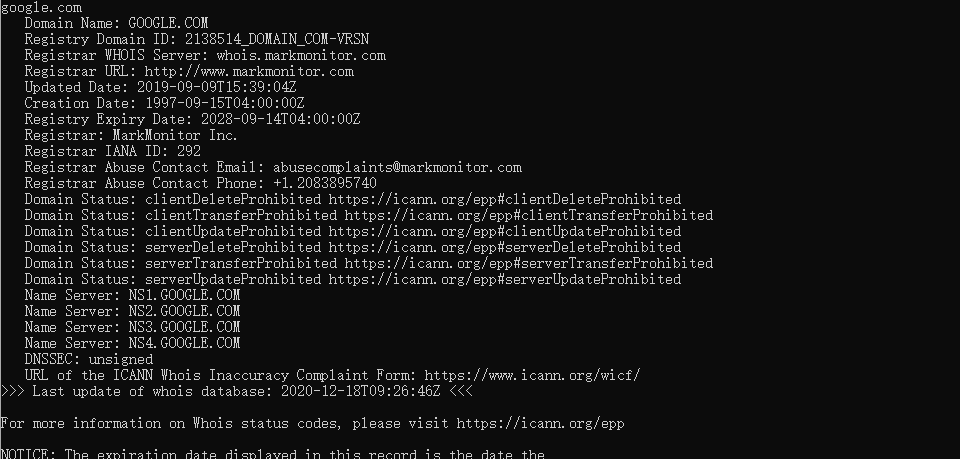

# WhoisClient

[](https://www.nuget.org/packages/WhoisClient/) 

A simple domain whois lookup library.

## Usage

````csharp
var client = new WhoisClient();
var whoisInfo = await client.LookupAsync("google.com");
````



## Reference

- https://github.com/flipbit/whois

- https://tools.ietf.org/html/rfc3912
